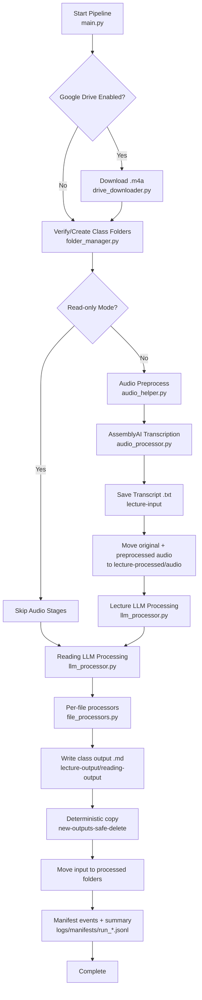

# Architecture and Data Flow

This document describes the OpenLawNotes runtime architecture and the end-to-end data flow.

## System Overview

OpenLawNotes is a staged batch pipeline:

1. Optional Google Drive ingestion for lecture audio.
2. Local folder structure verification and setup.
3. Audio preprocessing and AssemblyAI transcription.
4. Gemini-powered note generation for lecture transcripts and readings.
5. Deterministic output copy + run-manifest traceability.

## Components

- `main.py`
  - Orchestrates all pipeline stages.
  - Creates and finalizes a per-run manifest.
- `src/audio/drive_downloader.py`
  - Downloads new `.m4a` files from Drive class folders.
  - Moves downloaded Drive files to a Drive-side `Processed` folder.
- `src/audio/audio_helper.py`
  - Audio conversion and cleanup (M4A → WAV), denoising, filtering, transcript formatting.
- `src/audio/audio_processor.py`
  - Runs per-file transcription tasks with retry taxonomy.
  - Supports resume by skipping files with existing transcript outputs.
- `src/llm/gemini_client.py`
  - Encapsulates Gemini retries and classifies transient vs terminal API failures.
- `src/llm/file_processors.py`
  - Per-file text/PDF/Word processing for lecture and reading flows.
  - Writes deterministic copy names to `new-outputs-safe-delete` and records manifest entries.
- `src/llm/llm_processor.py`
  - Class-level orchestration and cross-class parallel execution for LLM stages.
- `src/utils/run_manifest.py`
  - Writes thread-safe JSONL run events and a summary JSON for traceability.

## Data Flow

## Retry and Error Taxonomy

- `RetryableServiceError`
  - Transient provider/network failures (rate limits, service unavailable, timeout).
  - Uses bounded exponential backoff.
- `NonRetryableServiceError`
  - Terminal provider failures that should not be retried.
- `AuthenticationError`
  - Invalid/expired auth credentials for provider APIs.
- `ConfigurationError`
  - Invalid local configuration (missing API key, unavailable model).
- `FileProcessingError` / `FileOperationError` / `PromptLoadError`
  - Local file and prompt issues.

## Idempotency and Resumability

- Audio stage:
  - If transcript `.txt` already exists and is non-empty, file is skipped and moved to processed.
- LLM stage:
  - If expected `.md` output already exists and is non-empty, file is skipped.
  - Existing output is copied to deterministic output location for consistency.
- Every success/skip/failure is recorded in the run manifest for replay/debug decisions.

## Run Manifest Artifacts

- Event stream (JSONL):
  - `logs/manifests/run_<UTC_TIMESTAMP>.jsonl`
- Summary file:
  - `logs/manifests/run_<UTC_TIMESTAMP>_summary.json`

Each file-level event contains:

- `stage`
- `class_name`
- `input_file`
- `status` (`success`, `failed`, `skipped`)
- `output_files` (if any)
- `message` and `error_type` (for failures)
